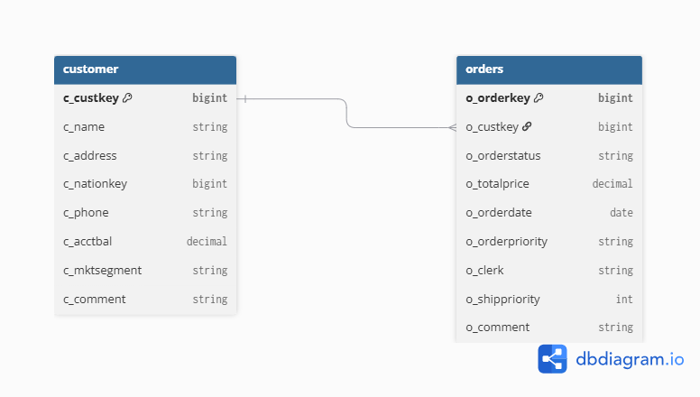

# Marketing Lakehouse Project

This project implements a Lakehouse architecture in Databricks using the Bronze, Silver, and Gold layers.

The project uses the TPC-H dataset and focuses on customer and order data to answer marketing-related business questions.

## Architecture

The project follows the Medallion Architecture:

- **Bronze** — raw data loaded from the source without transformations.
- **Silver** — validated and normalized data prepared for further analysis.
- **Gold** — business-oriented data used to answer analytical questions.

Data flow:

`samples.tpch → Bronze → Silver → Gold → Business Analysis`

## Silver Layer

The Silver layer contains validated and normalized customer and order data.

The following tables are created:

- `workspace.marketing_silver.customer`
- `workspace.marketing_silver.orders`

The tables preserve separate customer and order entities and are organized in Third Normal Form (3NF).

### Customer

Primary key:

`c_custkey`

The table contains customer information including name, address, account balance, market segment, and other customer attributes.

### Orders

Primary key:

`o_orderkey`

Foreign key:

`o_custkey → customer.c_custkey`

The table contains information about customer orders, including order date, total price, status, priority, and other order attributes.

### Silver ER Diagram



## Data Quality Validation

Data quality checks are performed before and after creating the Silver tables.

The following checks are implemented:

- Customer keys must not be NULL.
- Customer keys must be unique.
- Order keys must not be NULL.
- Order keys must be unique.
- Every order must reference an existing customer.

The customer reference validation checks whether every `o_custkey` from the orders table exists as a `c_custkey` in the customer table.

The validation uses a `left_anti` join to identify orders without a matching customer.

Validation result:

```text
Validation PASSED
Every order has a valid customer reference.
Invalid customer references: 0
```

## Business Question 2 — New Customers in 1996 Q1

**Question:**

How many new customers, based on their first order date, appeared in 1996 Q1?

A customer is considered new in the quarter if their first-ever order was placed between January 1, 1996 and March 31, 1996.

For each customer, the first order date is calculated as:

```text
MIN(o_orderdate)
```

Customers are then filtered using the following period:

```text
1996-01-01 <= first_order_date < 1996-04-01
```

### Result

**157 new customers** appeared in 1996 Q1.

Monthly breakdown:

| Month | New Customers |
|---|---:|
| January 1996 | 54 |
| February 1996 | 44 |
| March 1996 | 59 |
| **Total** | **157** |

The monthly distribution can also be visualized as a bar chart in the Databricks analysis notebook.

## Business Question 4 — 1996 Cohort Retention

**Question:**

Group customers by the month of their first order (cohort). For each 1996 cohort, what share of customers placed another order within the next three months?

Definitions:

- `first_order_date = MIN(o_orderdate)`; `cohort = month(first_order_date)`
- orders of a customer are ranked by `(o_orderdate, o_orderkey)`; the customer has **returned** if order #2 exists and
  `second_order_date <= add_months(first_order_date, 3)` (inclusive; a same-day second order counts)
- `retention_rate = returned_customers / cohort_customers`

The 3-month window is measured from each customer's own first order, not from the start of the cohort month.
`is_window_complete` checks that the data covers the full window for every customer in the cohort
(TPC-H orders run until 1998-08-02, so all 1996 cohorts are complete).

Result table: `workspace.marketing_gold.cohort_retention_1996`.

### Validation

`tests/test_cohorts_monitoring.py` checks that:

- there are exactly 12 cohorts, all in 1996, with complete observation windows
- `0 <= retention_rate <= 1` and `returned_customers <= cohort_customers`
- cohort sizes equal the number of Gold customers with a first order in that month
- January–March cohorts add up to the Q2 answer (new customers in 1996-Q1)

## Monitoring

Two Gold tables, one row per complete month:

- `monitoring_activation_rate_by_segment` — cumulative activation rate per segment
- `monitoring_new_customers_monthly` — new customers per month (with `quarter` for quarterly views)

Alerts: activation rate drop > 1 pp month over month; new customers < 50% of the trailing 3-month average.
Tests check that the latest monitored activation matches Gold and that monthly new customers sum to the Gold total.

## Relevant Files

Silver transformation:

```text
src/silver/customer.py
src/silver/orders.py
```

Business question analysis:

```text
src/analysis/new_customers.py
src/analysis/cohort_retention.py
src/monitoring/marketing_monitoring.py
```

Validation:

```text
src/validation/order_customer_reference.py
```

Databricks notebooks:

```text
notebooks/new_customers.ipynb
notebooks/validate_order_customer_reference.ipynb
notebooks/cohort_retention_monitoring.ipynb
notebooks/run_pipeline.ipynb
```

Dashboard datasets:

```text
dashboards/marketing_dashboard.sql
```

ER diagram:

```text
docs/silver_er_diagram.png
```